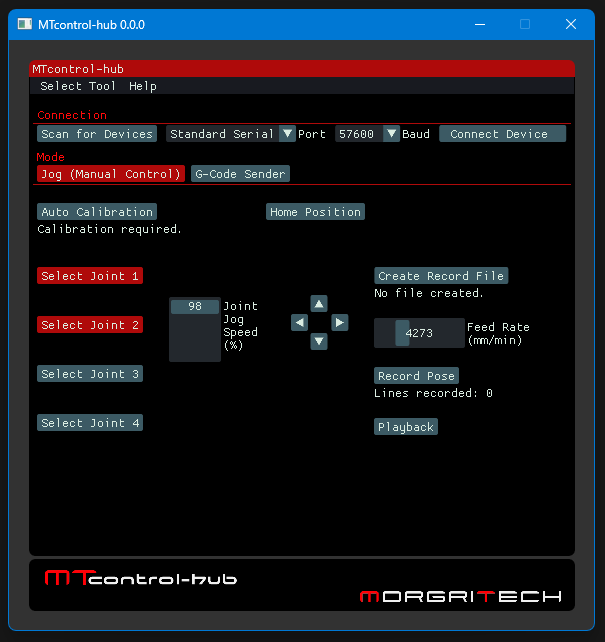
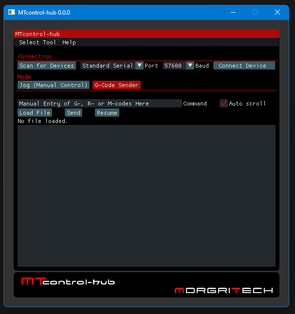

# MTcontrol-hub

Windows GUI software for controlling a 4-axis desktop robot arm.




## Introduction

This legacy project (developed as ncHub between 2017 and 2018, then as MTcontrol-hub between 2018 and 2020) was written in C++ using [openFrameworks](https://openframeworks.cc). Openframeworks is a C++ framework for developing cross-platform windowed applications built on the OpenGL library.

This project was an early-stage prototype. All code, documentation, and descriptions were originally written over 5 years ago and have been copied here with only minor modification. As such, they may lack polish, clarity, or completeness, and do not reflect current best practices.

The developed software; MTcontrol-hub, consists of a GUI (graphical user interface) for controlling the MTarm 4r robot (at prototype 2); a 4-axis desktop robot arm. The target counterpart firmware version for the robot is mtarm4r-mcu-firmware _controller-0.0.0 (Note: the counterpart firmware is currently closed source/private).

The [Dear ImGui](https://github.com/ocornut/imgui) library was used to develop the GUI, via the [ofxImGui](https://github.com/jvcleave/ofxImGui) binding for openFrameworks.

MTcontrol-hub can also be used as a general purpose G-code sender or serial console/terminal application.

The recommended method to build this project is with openFrameworks 0.11.x using Visual Studio 2017 Community. Newer versions may work but have not been tested. The entire project must be placed in the following directory:

``` text
...\openframeworks\of_v0.11.0_vs_release\apps\myApps
```

The release executable can be found in the [release folder](release). It is a portable program. Simply download the file `MTcontrol-hub 0.0.0.zip`, extract to your desired directory, open the `MTcontrol-hub 0.0.0` folder and double click on `MTcontrol-hub.exe` to start the application. It runs on the latest version of Windows (Windows 11 at the time of writing) and has also been tested on Windows 10.

## Usage

### Jog Mode

Note: The buttons in Jog mode control relevant actions when the software is connected to the aforementioned robot/firmware. If you want to control a different device, see the Communication Protocol (J-codes, G-codes, R-codes, and M-codes) section for the messages/commands sent from the software over serial when buttons are pressed.

- Connect your device and click `Scan for Devices` if your device is not displayed.
- Select your device from the `Port` drop-down list.
- Select the required baud rate from the `Baud` the drop-down list.
- Click `Connect to Device`.
- Note that Joint 1 is always selected by default - use `Left Arrow` and `Right Arrow` buttons to move joint 1. You can also use the Left and Right arrow keyboard keys to move joint 1.
- Click the relevant `Select joint` button to select joint 2, 3, or 4. You can also use the 2, 3 or 4 keyboard keys to select the joints. Use the `Up Arrow` and `Down Arrow` buttons to move the selected joint. You can also use the Up and Down arrow keyboard keys to move the selected joint.
- Click `Auto Calibration` to start the calibration process to home the joints. Press again to stop the process before completion.
- Click `Home Position` to move the robot to its soft home position. Press again to stop the process before completion.
- Click the `Select Tool` drop-down list to select a desired tool, the options are `No Tool`, `Pen`, `Gripper` and `Extruder`.
- If `Gripper` is selected, the following extra buttons appear: `Move Gripper` (Starts the gripper motor on press, stops the gripper motor on release), `Gripper Direction` (Change the gripper motor direction; grip/release).
- If `Extruder` is selected, the following extra buttons appear: `Select Extruder (Heated)` (Starts heating the extruder heating element to a predefined temperature), `Select Extruder (No Heat)` (Enable the extruder motor to be used cold), `Toggle Extruder` (Starts/stops the extruder motor), `Extruder Direction` (Change the extruder motor direction; extrude/retract).
- Use the `Joint Jog Speed` grab handle to set a percentage speed to move the joints; applicable to all joints.
- Click `Create Record File` to create a file for use to record robot joint positions.
- Use the `Feed Rate` grab handle to set a feed rate in mm/min for the robots end-effector. This will be used when playing back a recorded pose.
- Use the aforementioned buttons to move the robot into various desired positions and click `Record Pose` for each position. The number of lines recorded will be displayed.
- Click the `Playback` button to play back the current file containing recorded poses.
- Tip to continue recording from the end of a previously recorded file; playback the previously recorded file, create a new record file and record new positions, then combine the previously recorded file and the new manually by simply copying and pasting the code from the new file into the previously recorded file.

## Communication Protocol (J-codes, G-codes, R-codes, and M-codes)

### All modes

The following message is sent as soon as a serial connection is made:

``` gcode
J255\n
```

When connected to the MTarm 4r robot, this command instructs the firmware to reset the jog parameters.

### Tool selection

The following messages are sent in response to selecting the relevant options from the `Select Tool` drop-down list.

|GUI Button|Message |
|----------|--------|
|`No Tool` |`J000\n`|
|`Pen`     |`J021\n`|
|`Gripper` |`J031\n`|
|`Extruder`|`J041\n`|

### Jog mode

The following messages are sent in response the relevant GUI button or keyboard key being pressed:

|GUI Button        |Keyboard Key|Message |
|------------------|------------|--------|
|`Select Joint 1`  |1           |`J001\n`|
|`Select Joint 2`  |2           |`J002\n`|
|`Select Joint 3`  |3           |`J003\n`|
|`Select Joint 4`  |4           |`J004\n`|
|`Up arrow`        |Up arrow    |`J013\n`|
|`Left arrow`      |Left arrow  |`J011\n`|
|`Right arrow`     |Right arrow |`J012\n`|
|`Down arrow`      |Down arrow  |`J014\n`|
|`Joint Jog Speed` |N/A         |`J252T<speed value>\n`|
|`Auto Calibration`|N/A         |`J251\n`|
|`Home Position`   |N/A         |`R005\n`|
|`Record Pose`     |N/A         |`J253`  |

The MTarm 4r robot's firmware is expected to send following message when the calibration process is complete:

``` text
>
```

When a tool is selected (a serial device must first be connected), extra GUI buttons appear.

The following messages are sent in response to pressing the relevant Gripper buttons:

|GUI Button         |Message |
|-------------------|--------|
|`Move Gripper`     |`J032\n`|
|`Gripper Direction`|`J033\n`|

The following messages are sent in response to pressing the relevant Extruder buttons:

|GUI Button                 |Message |
|---------------------------|--------|
|`Select Extruder (Heated)` |`J042\n`|
|`Select Extruder (No Heat)`|`J043\n`|
|`Toggle Extruder`          |`J044\n`|
|`Extruder Direction`       |`J045\n`|

If Heated option is selected, the software expects to receive the following message from the MTarm 4r robot on completion:

``` text
}
```

The following message is sent in response to any action being canceled, such as as any of the arrow buttons or gripper move button transitioning from being held to being released, stopping Auto Calibration or homing before completion:

``` text
{
```

### G-Code Sender mode

When sending G-code continuously from a file, the software expects to receive the follow message from the MTarm 4r robot to confirm receipt and indicate that the next line of G-code should be sent:

``` text
>
```  

Also, the following message is sent at the start and end of the sending process, or when the process is stopped before completion:

``` gcode
R010\n
```

When connected to the MTarm 4r robot, the robots firmware keeps track of the robots pose in joint/configuration space by counting stepper motor steps. This command instructs it to perform forward kinematics to update the pose in cartesian/task space and obtain the end-effector's position and orientation.

See the aforementioned MTarm 4r robot's firmware for a full list of G-codes and M-codes supported by the robot.
